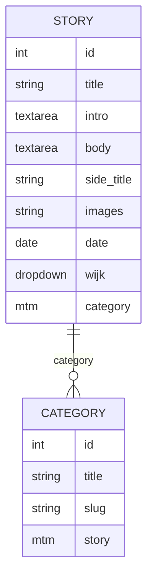

# Buurtcampuskrant

# Buurtcampuskrant

[Design Challenge](https://github.com/fdnd-agency/buurtkrant/wiki/Design-Challenge)

## Description
Our assignment was to work as a team to create a digital version of the buurtcampus newspaper. This is a collaboration between Amsterdam University of Applied Sciences and Amsterdam Public Library, spread across various districts: East, New West and South-East. Buurtcampuskrant organises various social projects and campaigns aimed at enriching the neighbourhood. Important themes include sustainability, the environment and learning. The newspaper keeps you informed about these activities that have taken place. A paper version that can reach a larger audience through a digital version. 

School intends to work with Svelte and Sveltekit. The focus was on dividing the site into different sections (components) that recur frequently on the website. A lot of attention was also paid to the use of colours. Finally, we had to get to work on information architecture and creating a data model.


## Design choices
Here is a [link](https://www.figma.com/design/6oqaIkpykJcOH2p2q61CGK/buurtcampuskrant?node-id=106-1687&t=jnIS8yCPm2Mt02DC-1) to a detailed version of the design. 

We had already been given a house style and the paper newspaper provided some guidance, but otherwise the design was entirely up to us. The newspaper features the different neighborhoods throughout Amsterdam and other news.

We chose to carry the colors associated with a particular neighborhood through to the smallest details. This can be seen, for example, in the header and footer, which use the matching background color for each neighborhood. But it can also be found in accent colors in, for example, the small overview of news articles and details such as a filter. 


Furthermore, the flag element is also frequently used in the menu, for example. This is used to open the menu (on small screens) and for the links in the navigation as a so-called :hover state (the animation that takes place when the mouse moves over a link). 


Of course, the design is responsive, so it works on both small and large screens. 


## Components
Components are various elements that appear frequently on multiple pages. Below are components that we have used. 

* [Header.svelte:](https://github.com/fdnd-agency/buurtcampuskrant/blob/dev/src/lib/components/Header.svelte) This component contains de header with the responsive navigation. It is also progressive enhanced, which means that it'll still work without JS and CSS. 
* [Article.svelte:](https://github.com/fdnd-agency/buurtcampuskrant/blob/dev/src/lib/components/Article.svelte) This component is a brief overview of the new item and links to its detail page.
* [Filter.svelte:](https://github.com/fdnd-agency/buurtcampuskrant/blob/dev/src/lib/components/filter.svelte) The filter component ensures that a neighbourhood page can be filtered according to different categories.
* [Quote.svelte:](https://github.com/fdnd-agency/buurtcampuskrant/blob/dev/src/lib/components/Quote.svelte) This component highlights a part from the article.
* [Footer.svelte:](https://github.com/fdnd-agency/buurtcampuskrant/blob/dev/src/lib/components/Footer.svelte) This component contains a newsletter, links to socials and a navigation. This will also take place on every page.  
* [Newsletter.svelte:](https://github.com/fdnd-agency/buurtcampuskrant/blob/dev/src/lib/components/Newsletter.svelte) The newsletter will be implemented in the footer. It goes without saying, but this is where people can subscribe to the newsletter.

Finally, the images of the logos have also been placed in components. This is because they are reused very often. 

## Features


## Datamodal


## Installation
First up, fork this project. Then move on. 

Open the terminal and walk through the following steps

```
npx sv create
```
```
npm run dev -- --open
```
^ This wil make sure you can follow your code changes live. 


