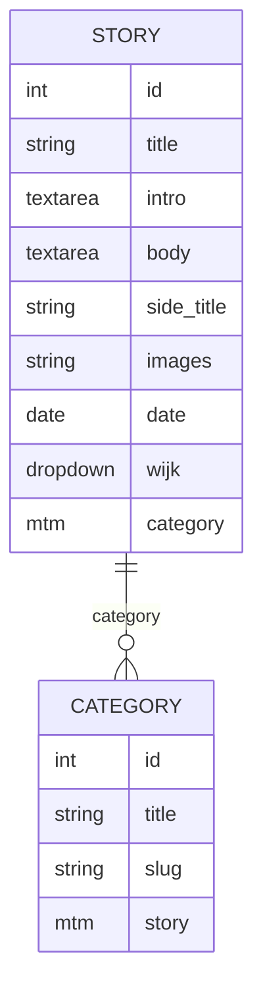

## Datamodel
In our database we have different articles (stories). These articles have their own id, title etc. The articles are all linked to their own category and district so that you can filter on those things. We have our datamodel like this:

