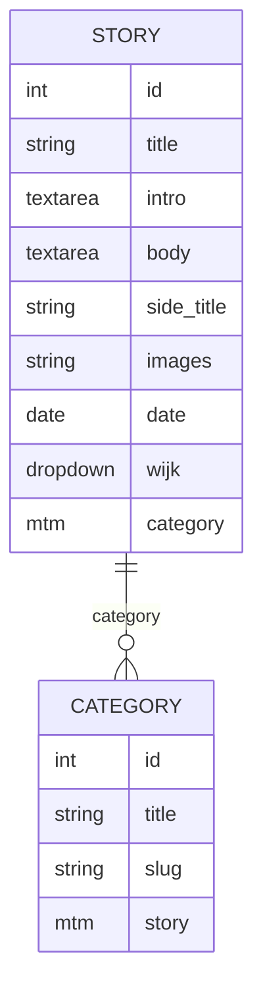

## Datamodel

```mermaid
erDiagram
    CATEGORY {
        int id
        string title
        string slug
        mtm story
    }
    STORY {
        int id
        string title
        textarea intro
        textarea body
        string side_title
        string images
        date date
        dropdown wijk
        mtm category
    }

    STORY ||--o{ CATEGORY : category 
```
